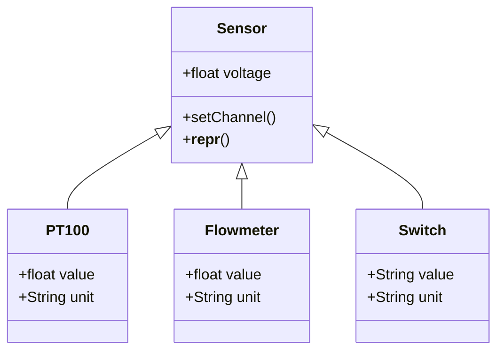

# rCFD Webservice
Scripts for providing the rCFD Measurement Data as an API. For the data aquisition a Labjack T7Pro is used. For fast and uncomplex aquisition all sensors retrieve analog signals, which are linear equal to the physical value.
## Sensors
For the experiment three different sensors are used. These sensors differ by their measuring principle. The following sensors are used 

- PT100: A active measurement transducer scales the aquired voltage to 0-10V. For back count mininal temperature T_min (0V) and maximal temperature T_max(10V) are needed.
- Flowmeter: The used devices provides an current output with life zero (4-20mA). For back count minimal mass flow mDot_min (4mA) and maximal massflow mDot_max (20mA) are need
- Switch: For detecting the bypass position the analog input (0-10V) is thresholded into 0/1.

For the representation of the sensor functionality an abstract base clas was used. All used Sensortypes (PT100, Flowmeter, Switch) inhearited from a main sensor Class



## Configuration
The Labjack configuration is saved as YAML file. For every sensor type the sensor name and channel are saved.
```yaml
PT100:
  Twarm: AIN0
  Tcold: AIN1
  Tout: AIN2
  h=35mm: AIN3
  h=65mm: AIN4
  h=95mm: AIN5
  h=125mm: AIN6
  h=155mm: AIN7
  h=185mm: AIN8
  h=215mm: AIN9
Flowmeter:
  warm_massflow: AIN11
  cold_massflow: AIN13
Switch:
  bypass: AIN10
```
## Webservice
For the webservice a simple REST API by the common used FLASK framework was build
```python
from labjack import ljm
from sensors import rCFD_Sensors
import json
from flask import Flask

DEVICE = "T7"
CONNECTION = "ETHERNET" # USB or ETHERNET
configFile = 'labjack.yml'

try:
    rCFD = rCFD_Sensors(
        device=ljm.openS(DEVICE, CONNECTION, "ANY"),
        configFile=configFile)
    print(f"Connected to {DEVICE} via {CONNECTION}")
except:
    print(f'Failure - could not connected to {DEVICE}')


app = Flask(__name__)
@app.route('/')
def index():
    return json.dumps(rCFD.data)
app.run()
```